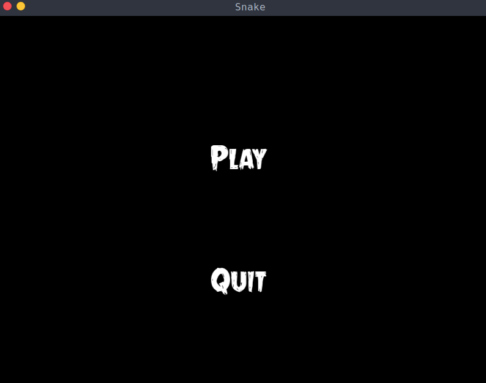
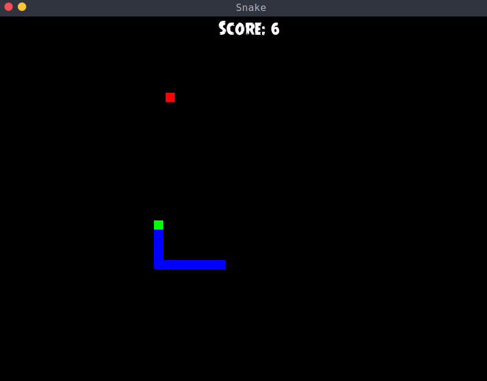

# SFML-Snake Game
# Simple first game with SFML

<!-- ABOUT THE PROJECT -->
## About The Project
I wanted to practice my c++ and also to be able to make simple 2d games for fun
so im learning SFML, this is curretly the first game that i made, its not the best
i think and ill probably will do some improvments and refactor some things.

### Built With

c++ and SFML

<!-- GETTING STARTED -->
## Getting Started
compile: g++ main.cpp -o sfml-app.o -lsfml-graphics -lsfml-window -lsfml-system
./sfml-app.o

### Example

### Prerequisites

c++ and SFML
## License

Distributed under the MIT License. See `LICENSE` for more information.

